# School Record Management System

## (Microservices Application - Clean Architecture - .NET)

[![github-shield]][github-url]
[![Issues][issues-shield]][issues-url]
[![LinkedIn][linkedin-shield]][linkedin-url]

---

## Overview[](#introduction)

This project is a microservices-based application built using .NET with Clean Architecture principles. Each service is independent, exposes HTTP endpoints, and follows a layered structure: **Presentation → Application → Domain → Infrastructure**.

```mermaid
%%{ init: {
  "theme": "default",
  "themeVariables": {
    "fontSize": "16px",
    "fontFamily": "sans-serif",
    "primaryColor": "#ffffff",
    "edgeLabelBackground": "#ffffff"
  }
}}%%

graph TD

    %% Class Definitions
    classDef service fill:#E8F4FA,stroke:#036,stroke-width:2px;
    classDef db fill:#FDEBD0,stroke:#8B4513,stroke-width:2px;
    classDef infra fill:#D5F5E3,stroke:#1E8449,stroke-width:2px;
    classDef serviceGroup fill:#FFFACD,stroke:#333,stroke-width:1px;
    classDef client fill:#F3E8FF,stroke:#5A2C91,stroke-width:2px;
    classDef gateway fill:#FFF8DC,stroke:#DAA520,stroke-width:3px;

    %% CI/CD Layer
    subgraph CICD["<b>CI/CD Pipeline</b><br/>(GitHub Actions)"]
        subgraph DockerHost["<b>Docker Host</b>"]
            gateway["🛡️ <b>API Gateway</b><br/>(Ocelot)"]:::gateway

            %% Core Services
            subgraph CoreServices["🧩 <b>Core Services</b>"]

                subgraph AuthGroup["🔐 <b>Auth</b>"]
                    auth["<b>Auth Service</b><br/>(.NET, JWT)"]:::service
                    auth_db[(auth_db)]:::db
                    
                    %% 0) connection between auth and auth_db - purple
                    auth <--> auth_db
                end

                subgraph UserGroup["👥 <b>User</b>"]
                    user["<b>User Service</b><br/>(.NET)"]:::service
                    user_db[(user_db)]:::db
                    
                    %% 1) connection between user and user_db - purple
                    user <--> user_db
                end

                subgraph StudentGroup["🎓 <b>Student</b>"]
                    student["<b>Student Service</b>"]:::service
                    student_db[(student_db)]:::db
                    
                    %% 2) connection between student and student_db - purple
                    student <--> student_db
                end

                subgraph CourseGroup["📚 <b>Course</b>"]
                    course["<b>Course Service</b>"]:::service
                    course_db[(course_db)]:::db
                    
                    %% 3) connection between course and course_db - purple
                    course <--> course_db
                end

                subgraph EnrollmentGroup["📝 <b>Enrollment</b>"]
                    enrollment["<b>Enrollment Service</b>"]:::service
                    enrollment_db[(enrollment_db)]:::db
                    
                    %% 4) connection between enrollment and enrollment_db - purple
                    enrollment <--> enrollment_db
                end

                subgraph GradeGroup["🏷️ <b>Grade</b>"]
                    grade["<b>Grade Service</b>"]:::service
                    grade_db[(grade_db)]:::db
                    
                    %% 5) connection between grade and grade_db - purple
                    grade <--> grade_db
                end

                subgraph ReportGroup["📊 <b>Report</b>"]
                    report["<b>Report Service</b>"]:::service
                    report_db[(report_db)]:::db
                    
                    %% 6) connection between report and report_db - purple
                    report <--> report_db
                end

                subgraph TutorGroup["🧑‍🏫 <b>Tutor</b>"]
                    tutor["<b>Tutor Service</b>"]:::service
                    tutor_db[(tutor_db)]:::db
                    
                    %% 7) connection between tutor and tutor_db - purple
                    tutor <--> tutor_db
                end

                subgraph AdminGroup["🛠️ <b>Admin</b>"]
                    admin["<b>Admin Service</b>"]:::service
                end
            end
        end
    end

    %% External Clients
    subgraph Client["<b>Client</b>"]
        frontend(["🌐 <b>Client App</b>"]):::client
    end

    %% Infra components
    auth0["🔐 <b>Auth0</b><br/>(Internal Auth)"]:::infra

    redis["⚡ <b>Redis Cache</b><br/>(Token Blacklist)"]:::infra

    %% Group Styling
    class AuthGroup,UserGroup,StudentGroup,CourseGroup,EnrollmentGroup,GradeGroup,ReportGroup,TutorGroup,AdminGroup serviceGroup;

    %% 8) connection between client and gateway - red
    frontend <-->|HTTP| gateway

    %% 9-17 ) connection between gateway and services - blue
    gateway <-->|HTTP| auth
    gateway <-->|HTTP| user
    gateway <-->|HTTP| course
    gateway <-->|HTTP| student
    gateway <-->|HTTP| enrollment
    gateway <-->|HTTP| grade
    gateway <-->|HTTP| report
    gateway <-->|HTTP| tutor
    gateway <-->|HTTP| admin

    %% 18-34) connection between services (inter-service connection) - green
    auth <-->|HTTP/JWT| user
    admin <-->|HTTP/JWT| user
    admin <-->|HTTP/JWT| course
    admin <-->|HTTP/JWT| student
    admin <-->|HTTP/JWT| enrollment
    admin <-->|HTTP/JWT| grade
    admin <-->|HTTP/JWT| tutor
    enrollment <-->|HTTP/JWT| course
    enrollment <-->|HTTP/JWT| user
    grade <-->|HTTP/JWT| enrollment
    report <-->|HTTP/JWT| course
    report <-->|HTTP/JWT| enrollment
    report <-->|HTTP/JWT| grade
    student <-->|HTTP/JWT| course
    student <-->|HTTP/JWT| user
    tutor <-->|HTTP/JWT| grade
    tutor <-->|HTTP/JWT| user

    %% 35-43) connection between services and Redis - orange dashed
    auth <-.->|HTTP| redis
    user <-.->|HTTP| redis
    course <-.->|HTTP| redis
    student <-.->|HTTP| redis
    enrollment <-.->|HTTP| redis
    grade <-.->|HTTP| redis
    report <-.->|HTTP| redis
    tutor <-.->|HTTP| redis
    admin <-.->|HTTP| redis

    %% 44-50) connection between services and Auth0 - brown dashed
    auth <-.->|HTTP| auth0
    student <-.->|HTTP| auth0
    enrollment <-.->|HTTP| auth0
    grade <-.->|HTTP| auth0
    report <-.->|HTTP| auth0
    tutor <-.->|HTTP| auth0
    admin <-.->|HTTP| auth0

    %% Link Styling for distinct groups
    linkStyle 0,1,2,3,4,5,6,7 stroke:#8B5CF6,stroke-width:2px;
    linkStyle 8 stroke:#EF4444,stroke-width:3px;
    linkStyle 9,10,11,12,13,14,15,16,17 stroke:#3B82F6,stroke-width:2px;
    linkStyle 18,19,20,21,22,23,24,25,26,27,28,29,30,31,32,33,34 stroke:#10B981,stroke-width:2px;
    linkStyle 35,36,37,38,39,40,41,42,43 stroke:#F97316,stroke-width:1.5px,stroke-dasharray: 5 5;
    linkStyle 44,45,46,47,48,49,50 stroke:#92400E,stroke-width:1.5px,stroke-dasharray: 4 2;

```


---

## Prerequisites[](#prerequisites)
To run this project, ensure you have the following installed:
* **.NET SDK v9.0**: This project uses .NET v9.0 for development and runtime.
* **Docker**: Required for containerizing and running the services.
* **Docker Compose**: Used to manage multi-container deployments.
* **PostgreSQL**: Each service requires a PostgreSQL database.
* **Redis**: Used for token management and caching.

---

## Services[](#pre-commit-hook)

The application currently consists of the following services:
* **Auth Service**: Handles JWT authentication, refresh tokens, and uses Redis for token management.
* **User Service**: Manages user-related operations.
* **Course Service**: Handles course-related functionality.
* **Student Service**: Manages student data and operations.
* **Enrollment Service**: Manages student enrollments in courses.
* **Grade Service**: Handles grading and assessment.
* **Report Service**: Generates reports/transcripts for students.
* **Tutor Service**: Manages tutor-related functionality.
* **Admin Service**: Provides administrative capabilities.
* **API Gateway**: Implemented using Ocelot (handling routing/authentication).

---

## Architecture[](#pre-commit-hook)
* **Clean Architecture**: Each service follows the Clean Architecture pattern with distinct layers.
* **HTTP Endpoints**: Services expose RESTful APIs for interaction.
* **Database-per-Service**: Each service has its own PostgreSQL database.

---

## Authentication[](#pre-commit-hook)
* **JWT and Refresh Tokens**: Clients obtain tokens from the Auth Service.
* **Token Validation**: All services validate tokens using a shared Redis cache.
* **Token Invalidation**: Managed by the Auth Service, with updates pushed to Redis.
* **Service-to-Service Auth**: Uses Auth0 for internal token-based authentication.

---

## Inter-service Communication[](#pre-commit-hook)
* Services communicate via HTTP clients (no message bus currently).

---

## Data Layer[](#pre-commit-hook)
* **PostgreSQL**: Each service has its own dedicated database, except the AdminService which has none.
* **Redis**: Used for token blacklist checks and planned for future caching.

---

## Deployment[](#pre-commit-hook)
* **Docker**: All services run inside Docker containers.
* **CI/CD**: Automated via GitHub Actions for building, testing (pushing Docker images planned for later).

---

## Testing[](#pre-commit-hook)
* **TDD Approach**: Tests are written using:
  * **xUnit**: For unit testing.
  * **Moq**: For mocking dependencies.
  * **FluentAssertions**: For readable assertions.

---

## Planned Features[](#pre-commit-hook)
* **Frontend**: A web app is planned but not yet implemented.
* **Logging and Service Discovery**: To be added in future iterations.

---

## Getting Started[](#pre-commit-hook)
* Clone the repository:
```
git clone https://github.com/segundara-visma/srms_services.git
```
* Ensure Docker and .NET SDK are installed.
* Build and run services using Docker Compose:
```
docker-compose up --build
```
* Access the services via the provided api-gateway BaseUrl in ocelot.json.

---

[](#school-record-management-system)

[issues-shield]: https://img.shields.io/github/issues/segundara-visma/srms_services.svg?style=flat-square
[issues-url]: https://github.com/segundara-visma/srms_services/issues
[linkedin-shield]: https://img.shields.io/badge/-LinkedIn-black.svg?style=flat-square&logo=linkedin&colorB=555
[linkedin-url]: https://www.linkedin.com/in/olusegunemmanuelokedara/
[github-shield]: https://img.shields.io/static/v1?label=Version%20control&message=Github&color=blue
[github-url]: https://github.com/segundara-visma/srms_services